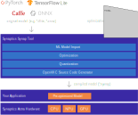

Introduction
============

SyNAP is a software tool that optimizes neural network models for on-device inference by targeting *NPU* or *GPU* hardware accelerators in [Synaptics Astra Embedded Processors](https://www.hellotics.com/products/embedded-processors). To do this, it takes models in their original representation (e.g., Tensorflow Lite, PyTorch, or ONNX) and compiles them to a binary network graph `.hello` format specific to the target hardware, ready for inference.

Compiling models for NPU
------------------------

Compilation of models for embedded applications using ahead-of-time compilation can usually be done with a [single command](optimizing_models.md). Optimization options (e.g. [mixed quantization](tutorials/model_import), [heterogeneous inference](heterogeneous_inference)) can be also passed at compile time using a [YAML metafile](conversion-metafile), and the model can be signed and encrypted to support Synaptics SyKURE™ secure inference technology.



```{important}
While optimal for the target hardware, a pre-optimized model is target specific and will fail to execute on different hardware.
```


Running inference
-----------------

There are a number of ways you can run [inference](inference.md) using compiled `.hello` models on Synaptics Astra hardware:

- Image classification, object detection, and image processing using `hello_cli` commands.
- Gstreamer plugin and Python examples for streaming media (e.g., webcam object detection).
- Embedded applications developed in C++ or Python can use the [SyNAP Framework API](./framework_api.rst).

```{tip}
The simplest way to start experimenting with *SyNAP* is to use the sample precompiled models and applications that come preinstalled on the Synaptics Astra board.
```

JIT compilation
---------------

For portable apps (e.g., targeting Android) you might consider the [JIT compilation](jit_compilation.md) approach instead. This approach uses a Tensorflow Lite external delegate to run inference using the original `.tflite` model directly.

This offers the greatest hardware portability, but there are a few disadvantages to this approach. Using this method requires any hardware-specific optimizations be done in the TensorFlow training or TFLite model export stages, which is much more involved than post-training quantization using SyNAP. Additionally, initialization time can take a few seconds on first inference, and secure media paths are not available.

Model Profiling & Benchmarks
----------------------------

SyNAP provides [analysis tools](sysfs-inference-counter) in order to identify bottlenecks and optimize models. These include:

- Overall model inference timing
- NPU runtime statistics (e.g., overall layer and I/O buffer utilization)
- Model profiling (e.g., per-layer operator type, execution time, memory usage)

You can also find a [comprehensive list of reference models and benchmarks](benchmark).

NPU Hardware
------------

SyNAP aims to make best use of supported [neural network operators](npu_operators) in order to accelerate on-device inference using the available NPU or GPU hardware. The NPUs themselves consist of several distinct types of functional unit:

- **Convolutional Core**: Optimized to only execute convolutions (int8, int16, float 16).
- **Tensor Processor**: Optimized to execute highly parallel operations (int8, int16, float 16).
- **Parallel Processing Unit**: 128-bit SIMD execution unit (slower, but more flexible).
- **Internal RAM**: Used to cache data and weights.


| Chip         | Neural Network Core | Tensor Processor   | Parallel Processing Unit |
|--------------|---------------------|--------------------|--------------------------|
| VS640, SL1640| 4                   | 2 Full + 4 Lite    | 1                        |
| VS680, SL1680| 22                  | 8 Full             | 1                        |
